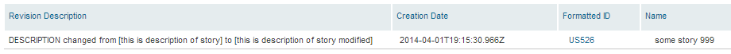

Get Revisions where Description was changed
=========================

## Overview
Fetching Revision History is expensive.
This means that the subset of the artifacts for which you get RevisionHistory has to be small.
In this example only stories updated withing the last 4 weeks are used: 

var howFarBack = rally.sdk.util.DateTime.add(new Date(), "week", -4);  
var howFarBackISO = rally.sdk.util.DateTime.toIsoString(howFarBack);
    function itemQuery() {
        var queryObject = {
            key: 's',
            type: 'HierarchicalRequirement',
            fetch: 'Name,ObjectID,FormattedID,RevisionHistory,Revisions,RevisionDescription,CreationDate,LastUpdateDate,Description',
            query: '(LastUpdateDate > "' + howFarBackISO + '")'
    };
                

This app comes AS IS. It is not supported by Rally support.
## License

AppTemplate is released under the MIT license.  See the file [LICENSE](https://raw.github.com/RallyApps/AppTemplate/master/LICENSE) for the full text.
